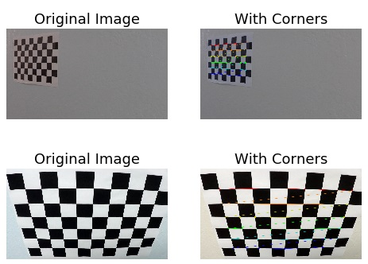
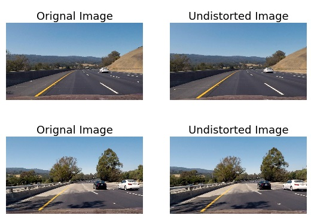
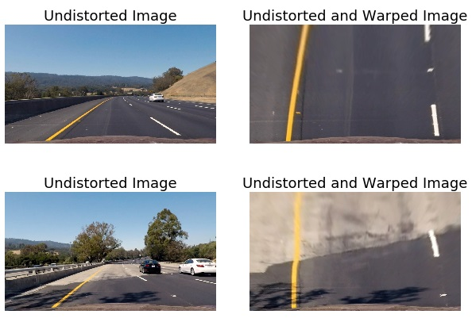
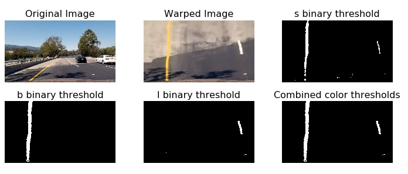
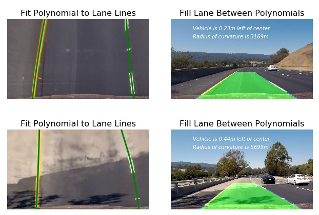

# Advanced Lane Finding

## Udacity Self Driving Car Engineer Nanodegree - Project 4

The goal of this project is to develop a pipeline to process a video stream from a forward-facing camera mounted on the front of a car, and output an annotated video which identifies:
- The positions of the lane lines
- The location of the vehicle relative to the center of the lane
- The radius of curvature of the road

The pipeline created for this project processes images in the following steps:
- **Step 1**: Apply distortion correction using a calculated camera calibration matrix and distortion coefficients.
- **Step 2**: Apply a perspective transformation to warp the image to a birds eye view perspective of the lane lines.
- **Step 3**: Apply color thresholds to create a binary image which isolates the pixels representing lane lines.
- **Step 4**: Identify the lane line pixels and fit polynomials to the lane boundaries.
- **Step 5**: Determine curvature of the lane and vehicle position with respect to center.
- **Step 6**: Warp the detected lane boundaries back onto the original image.
- **Step 7**: Output visual display of the lane boundaries and numerical estimation of lane curvature and vehicle position.

### Files for submission:
This project requires python 3.5 and the following dependencies:
-  **result.mp4** - line detection result
-  **challenge_video.mp4** - challenge video line detection result

### Step 1: Distortion Correction
I calibrate the camera using given distorted images of a chessboard and the cv2.findChessboardCorners() function. I start by preparing "object points", which will be the (x, y, z) coordinates of the chessboard corners in the world. Here I am assuming the chessboard is fixed on the (x, y) plane at z=0, such that the object points are the same for each calibration image. Thus, obj_points_const is just a replicated array of coordinates, and obj_points will be appended with a copy of it every time I successfully detect all chessboard corners in a test image. img_points will be appended with the (x, y) pixel position of each of the corners in the image plane with each successful chessboard detection.

I then use the output obj_points and img_points to compute the camera calibration and distortion coefficients using the cv2.calibrateCamera() function. I applied this distortion correction to the test image using the cv2.undistort() function and obtained this result:

 The next step was to undistort the images and I created the "undistort()" function. This function uses cv2.undistort() with the camera matrix and distortion coefficients calculated during camera calibration to return undistorted versions of all input images.

### Step 2: Perspective Transform
The goal of this step is to transform the undistorted image to a "birds eye view" of the road which focuses only on the lane lines and displays them in such a way that they appear to be relatively parallel to eachother (as opposed to the converging lines you would normally see). To achieve the perspective transformation I first applied the OpenCV functions `getPerspectiveTransform` and `warpPerspective` which take a matrix of four source points on the undistorted image and remaps them to four destination points on the warped image. The source and destination points were selected manually by visualizing the locations of the lane lines on a series of test images.

The next step was to apply a perspective transform on images. When the camera registers the images all the parallel lines seem to meet in a specific point which is not true. I created the birds_eye() function to apply a perspective transform on images so that we obtain images from a perspective as they would be seen from the top. Inside it I used the previous undistort() function that I created to undistort the images. After that I applied the cv2 getPerspectiveTransform() to transform the images. And the final step was to use the cv2 warpPerspective function to warp the images.

### Step 3: Binary Thresholds
In this step I attempted to convert the warped image to different color spaces and create binary thresholded images which highlight only the lane lines and ignore everything else.
I found that the following color channels and thresholds did a good job of identifying the lane lines in the provided test images:
- The S Channel from the HLS color space, with a min threshold of 180 and a max threshold of 255, did a fairly good job of identifying both the white and yellow lane lines, but did not pick up 100% of the pixels in either one, and had a tendency to get distracted by shadows on the road.
- The L Channel from the LUV color space, with a min threshold of 225 and a max threshold of 255, did an almost perfect job of picking up the white lane lines, but completely ignored the yellow lines.
- The B channel from the Lab color space, with a min threshold of 155 and an upper threshold of 200, did a better job than the S channel in identifying the yellow lines, but completely ignored the white lines.

I chose to create a combined binary threshold based on the three above mentioned binary thresholds, to create one combination thresholded image which does a great job of highlighting almost all of the white and yellow lane lines.

### Steps 4, 5 and 6: Fitting a polynomial to the lane lines, calculating vehicle position and radius of curvature:
I calculate the radius of curvature in fill_line() function by averaging the curvature of the left and right lane lines. I calculate the position of the vehicle with respect to the center of the lane . I calculate this by measuring the distance from the center of the frame to the bottom of the left and right lines and taking the difference of those. In my code, negative distance represents that the car is to the left of center, while positive distance represents to the right.

### Step 7: Output visual display of the lane boundaries and numerical estimation of lane curvature and vehicle position.
Function `fill_line()` is used to warp the detected lane lines back onto the original image and plot the detected lane using a filled polygon. It also plots additional information in the top left corner and at bottom of the image/video frame:

- Curvature and position of the car relative to the lane center is plotted in the top left corner

- The position of the car is indicated at the bottom with a long vertical white line. The detected lane center is indicated using a short white line. In the project video the car stays relatively close to the center of the lane, though it is mostly positioned somewhat to the left of the lane's center.

## Video Processing Pipeline:

The video processing pipeline is very similar to the `fill_lanes()` function, except that the video pipeline stores information about the lane lines across frames to average the lane positions and ensure a smooth output which is less impacted by outliers.

The video pipeline also knows whether or not the lane line was detected in the previous frame, and if it was, it only checks for lane pixels in a tight window around the previous polynomial, ensuring a high confidence detection. If the lane line was not detected in the previous frames (and for the first 5 frames of the video) The pipeline performs the same search which was performed in the fill_lanes() function based on identifying peaks in a histogram.

### Possible Limitations:
I believe this non-optimal performance could be fixed by improving several aspect of the pipeline:
* edges detection: the latter remains quite noisy on the last video, and I think could be improved significantly. One way to do so could be to compute the skelelon on edges masks, and then remove small noisy components, keeping only long lines. It would help the RANSAC algorithm by removing quite a lot of noisy points, and also speed up computation by reducing the number of points to iterate on;
* the RANSAC algorithm could be implemented on GPU: the main operations can be easily parallelized, and such an implementation would massively speed up the process. With current parameters, it takes around 0.1 second to run the former, and I guess a GPU implementation would be faster by several factors;
* edges masks could also be directly computed on GPUs, since it only consists of simple filter convolutions;
* as shown in the debug videos, adjacent lanes could also be determined. The previous pipeline can be easily adapted to this setting, and I think that such a computation could also make the overall segmentation process more robust to noise.

Of course, a complete different approach is possible using convolutional neural networks. The recent literature on lanes detections tends to go in this direction as it happens to be more robust to noise and allows to optimise the full pipeline instead of every brick inside.
